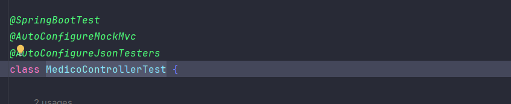

## 💻 Sobre o projeto

Voll.med é uma clínica médica fictícia que precisa de um aplicativo para gestão de consultas. O aplicativo deve possuir
funcionalidades que permitam o cadastro de médicos e de pacientes, e também o agendamento e cancelamento de consultas.

Enquanto um time de desenvolvimento será responsável pelo aplicativo mobile, o nosso será responsável pelo
desenvolvimento da API Rest desse projeto.

---

## ⚙️ Funcionalidades

- [x] CRUD de médicos;
- [x] CRUD de pacientes;
- [ ] Agendamento de consultas(em breve);
- [ ] Cancelamento de consultas(em breve);

---

## 🎨 Layout

O layout da aplicação mobile está disponível neste
link: <a href="https://www.figma.com/file/N4CgpJqsg7gjbKuDmra3EV/Voll.med">Figma</a>

---

## 📄 Documentação

A documentação das funcionalidades da aplicação pode ser acessada neste
link: <a href="https://trello.com/b/O0lGCsKb/api-voll-med">Trello</a>

---

## 🛠 Tecnologias

As seguintes tecnologias foram utilizadas no desenvolvimento da API Rest do projeto:

- **[Java 17](https://www.oracle.com/java)**
- **[Spring Boot 3](https://spring.io/projects/spring-boot)**
- **[Maven](https://maven.apache.org)**
- **[MySQL](https://www.mysql.com)**
- **[Hibernate](https://hibernate.org)**
- **[Flyway](https://flywaydb.org)**
- **[Lombok](https://projectlombok.org)**
- **[Swagger](https://springdoc.org/)**

---

## 📝 Licença

Projeto desenvolvido por [Alura](https://www.alura.com.br) e utilizado nos cursos de Spring Boot.

Instrutor: [Rodrigo Ferreira](https://cursos.alura.com.br/user/rodrigo-ferreira)

---

## Como injetar um conjunto de classes em um serviço?

## SpringDoc

## Configurando o spring security

1- Adicionar a dependência no projeto:

````
<dependency>
			<groupId>org.springframework.boot</groupId>
			<artifactId>spring-boot-starter-security</artifactId>
		</dependency>

		<dependency>
			<groupId>org.springframework.security</groupId>
			<artifactId>spring-security-test</artifactId>
			<scope>test</scope>
		</dependency>

````

2- Criar a classe de autenticação:

OBS: Sempre que o usuário fazer login na aplicação ele chamará o método `UserDetailsService`, passando o username que vem do formulário de login

````
@Service
public class AutenticacaoService implements UserDetailsService {

    @Override
    public UserDetails loadUserByUsername(String username) throws UsernameNotFoundException {
        return null;
    }
}

````

3- Ensinar o spring a não usar o processo de autenticação padrão criando a classe `securityFilterChain`

- Desabilite o csrf --> 
- Configurar a aplicação para ser statless

````

@Configuration
@EnableWebSecurity
public class SecurityConfiguration {

    @Bean//devolve um objeto para o spring
    public SecurityFilterChain securityFilterChain(HttpSecurity http) throws Exception {
        return http.csrf().disable()
                .sessionManagement().sessionCreationPolicy(SessionCreationPolicy.STATELESS)
                .and().build();
    }
}

````

## Tipos de testes automatizados

1. Testes de Unidade (Unit Tests):
   Testes que verificam a funcionalidade de unidades isoladas de código, como métodos ou classes individuais. Para APIs,
   isso pode incluir testes de métodos que processam entradas e produzem saídas esperadas.

2. Testes de Integração (Integration Tests):
   Testes que verificam a interação entre diferentes partes do sistema. Para APIs, isso envolve testar se os componentes
   da
   API funcionam corretamente em conjunto.

## Testes automatizados

Imagine que você está construindo uma casa. Durante a construção, você precisa testar cada etapa para garantir que tudo
está funcionando corretamente. Os testes automatizados são como os engenheiros que verificam se as paredes estão bem
construídas, se a fiação elétrica está correta, se as tubulações estão funcionando, entre outros.

Nesse projeto, usamos a biblioteca JUnit, que é como um conjunto de ferramentas que os engenheiros usam para
realizar esses testes automatizados. O JUnit já está incluído no projeto do Spring Boot, assim como outras ferramentas
úteis.

Além disso, configuraramos um banco de dados exclusivo para os testes. É como ter um ambiente de testes
separado da casa principal, onde você pode fazer todas as verificações necessárias sem afetar o funcionamento da casa em
si.

*Detalhes de implementações*

1. Para se testatar uma classe é preciso avisar ao spring com uma notação ``@DataJpaTest``
2. Apontar qual aplication.properties ele deve se referenciar para os testes ``@AutoConfigureTestDatabase``
3. Criar o banco de testes que no caso é o *[application-test]*

## Testando uma classe controller

para testar o Controller no Spring Boot, que é responsável por receber as requisições dos
clientes na API e chamar as classes que executam as regras de negócio e persistência. Utilizamos a classe MockMvc do
Spring para simular requisições HTTP e testamos o cenário em que uma requisição inválida é feita para agendar uma
consulta, verificando se o código de resposta é 400. Além disso, utilizei a anotação @WithMockUser para simular um
usuário logado durante o teste.

**Detalhes**

1. Para subir o contexto completo do spring é necessário usar a anotação ``@SpringBootTest``

## Classe MockMvc do Spring

A classe MockMvc faz parte do framework Spring MVC Test, que é uma extensão do Spring Framework para facilitar a escrita
de testes de integração para aplicativos web baseados em Spring MVC. O Spring MVC Test fornece várias classes e
utilitários para simular o comportamento de um contêiner de servlet durante a execução dos testes, permitindo que você
teste seus controladores e camada de web sem a necessidade de um contêiner real.

A classe MockMvc é central nesse contexto. Ela é usada para simular as solicitações HTTP enviadas para seus
controladores Spring MVC e permite que você verifique o comportamento do controlador, o conteúdo da resposta e outros
aspectos da interação HTTP.

O objetivo desse teste foi verificar se o código de resposta é 400 em um cenário de requisição inválida para agendar uma
consulta.
Além disso, foi a anotação @WithMockUser para simular um usuário logado durante o teste. Essa prática é essencial
para garantir que a API está respondendo corretamente e tratando os erros de forma adequada.

## JUnit o que é?

O JUnit é um framework de teste unitário para a linguagem de programação Java. Desenvolvido originalmente por Erich
Gamma e Kent Beck, é uma ferramenta popular entre os desenvolvedores Java para escrever e executar testes automatizados
em seus códigos.

Os testes unitários são partes essenciais da prática de desenvolvimento de software conhecida como TDD (Test-Driven
Development) e BDD (Behavior-Driven Development). Eles ajudam os desenvolvedores a garantir que cada unidade individual
de código (como métodos ou classes) funcione conforme o esperado, mesmo após alterações ou adições ao código.

O JUnit fornece uma estrutura simples e intuitiva para escrever testes, com métodos de asserção para verificar se
determinadas condições são verdadeiras. Ele também oferece anotações, como @Test, para marcar métodos de teste, e várias
funcionalidades para configurar testes, como @Before, @After, @BeforeClass e @AfterClass, que permitem a execução de
código de configuração e limpeza antes e depois dos testes.

## @Teste para que serve?

O @Test é uma anotação fornecida pelo framework JUnit, que é uma estrutura de teste unitário para a linguagem de
programação Java. Quando você coloca a anotação @Test acima de um método em uma classe de teste, você está indicando ao
JUnit que esse método contém um teste unitário a ser executado.

O JUnit então executa todos os métodos anotados com @Test e relata quais passaram e quais falharam. Ele fornece uma
estrutura simples e eficaz para escrever e executar testes unitários em código Java, o que é fundamental para garantir
que seu código funcione corretamente e mantenha a qualidade ao longo do tempo, especialmente em projetos de grande
escala onde mudanças podem ter efeitos colaterais inesperados.

## Anotações para se testar uma classe controller



1. @SpringBootTest: é usada para indicar que um teste deve carregar a configuração completa da aplicação Spring durante
   a execução do teste.

2. @AutoConfigureMockMvc: é uma classe fornecida pelo Spring Test que permite simular solicitações HTTP e testar os
   controladores MVC sem a necessidade de iniciar um contêiner de servlets real.

3. @AutoConfigureJsonTesters:  é usada para configurar automaticamente os JacksonTesters no contexto do teste que são
   usados para serializar e desserializar objetos JSON durante os testes, facilitando a comparação de objetos JSON
   esperados e reais.

## Comandos para rodar o projeto no terminal

**java -jar .\target\api-0.0.1-SNAPSHOT.jar**

1. Por padrão ele subirá o aplcation.properties padrão, que não é o que queremos. Para poder definir o tipo de perfil a
   ser usado basta adicionar o parâmetro:

````text
java -Dspring.profiles.active=prod -jar .\target\api-0.0.1-SNAPSHOT.jar

ou para Windows (" comando entre aspas ")

java "-Dspring.profiles.active=prod" -jar .\target\api-0.0.1-SNAPSHOT.jar

outra forma com variáveis de hambiente

java -Dspring.profiles.active=prod -DDATASOURCE_URL=jdbc:mysql://localhost/vollmed_api -DDATASOURCE_USERNAME=root -DDATASOURCE_PASSWORD=root -jar target/api-0.0.1-SNAPSHOT.jar

````

# V o l l . m e d _ A p i _ V 3 _ 
 
 